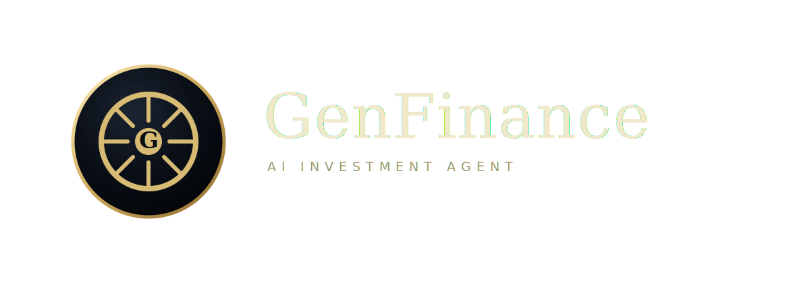

<p align="center">
  
</p>

# miniStockAgent
miniStockAgent는 AWS Bedrock Knowledge Base, Financial Modeling Prep(FMP), Tavily를 연동한 주식 리서치 보조 Agent 프로젝트입니다. 사용자의 투자 관련 질문에 대해 내부 또는 개인 리서치 자료를 우선 검색하고, 필요한 경우 최신 웹 정보와 정량 금융 데이터를 보완하여 한국어 분석 답변을 생성합니다.

본 프로젝트는 투자 판단을 자동화하는 시스템이 아닙니다. 자료 검색, 정보 요약, 분석 초안 작성을 보조하는 목적이며, 최종 투자 결정과 그 결과에 대한 책임은 사용자에게 있습니다.

## 주요 기능

| 구분 | 설명 |
| --- | --- |
| Knowledge Base 검색 | AWS Bedrock Knowledge Base에 적재된 리서치 자료, 문서, 보고서를 검색합니다. |
| 최신 정보 검색 | Tavily API를 통해 뉴스, 시장 동향, 기업 이슈 등 웹 기반 최신 정보를 조회합니다. |
| 금융 데이터 조회 | FMP API를 통해 주가, 기업 프로필, 재무제표, 재무비율, 시가총액 등 정량 데이터를 조회합니다. |
| 한국 상장사 심볼 변환 | KRX 종목 마스터 데이터를 참고하여 일부 한국 상장사 이름과 종목코드를 FMP 조회용 심볼로 변환합니다. |
| 실행 인터페이스 | Streamlit 기반 채팅 UI와 CLI 대화 모드를 제공합니다. |
| 테스트 | 외부 API와 AWS를 실제 호출하지 않는 단위 테스트를 포함합니다. |

## 동작 구조

투자 관련 질문은 다음 순서로 처리되도록 Agent 프롬프트와 턴별 지시문이 구성되어 있습니다.

1. 사용자 질문을 새로운 투자 분석 요청으로 해석합니다.
2. 첫 번째 도구 호출로 AWS Bedrock Knowledge Base의 `retrieve`를 사용합니다.
3. Knowledge Base 결과가 부족하거나 최신 정보가 필요한 경우 Tavily 검색을 사용합니다.
4. 주가, 재무제표, 재무지표 등 정량 데이터가 필요한 경우 FMP API를 사용합니다.
5. 사용한 근거와 출처를 포함하여 한국어 답변을 생성합니다.

## 프로젝트 구조

```text
.
├── chat_app.py                 # Streamlit 채팅 UI
├── stock_agent.py              # CLI 실행 진입점
├── genfinance/
│   ├── agent_factory.py        # Strands Agent 생성, 모델 선택, 도구 등록
│   ├── env.py                  # .env 로딩 및 AWS 환경 변수 보정
│   ├── stock_prompt.py         # Agent 시스템 프롬프트
│   └── stock_tools.py          # Tavily/FMP 도구 및 KRX 심볼 변환 로직
├── ui/
│   ├── assets/                 # UI 정적 자산
│   └── chat_style.py           # Streamlit 스타일 정의
├── docs/s3/raw/krx/            # 예시 KRX 원천 데이터
├── tests/                      # 단위 테스트
├── node-sample/                # Node.js 샘플 코드
├── requirements.txt            # Python 의존성
└── README.md
```

## 요구 사항

- Python 3.10 이상 권장
- AWS Bedrock 및 Knowledge Base 접근 권한
- Tavily API 키
- Financial Modeling Prep API 키

Knowledge Base, Tavily, FMP 관련 환경 변수가 없으면 해당 기능은 제한됩니다. 단위 테스트는 외부 API 키 없이 실행할 수 있습니다.

## 설치

```bash
python3 -m venv .venv
source .venv/bin/activate
pip install -r requirements.txt
```

## 환경 변수 설정

프로젝트 루트에 `.env` 파일을 생성하고 필요한 값을 설정합니다.

```env
KNOWLEDGE_BASE_ID=
TAVILY_API_KEY=
FMP_API_KEY=
AWS_REGION=
AWS_PROFILE=
BEDROCK_MODEL_ID=
```

| 이름 | 필수 여부 | 설명 |
| --- | --- | --- |
| `KNOWLEDGE_BASE_ID` | 권장 | AWS Bedrock Knowledge Base ID입니다. 값이 없으면 Knowledge Base 검색이 제한됩니다. |
| `TAVILY_API_KEY` | 권장 | Tavily 웹 검색 API 키입니다. 값이 없으면 최신 뉴스와 웹 검색이 제한됩니다. |
| `FMP_API_KEY` | 권장 | FMP 금융 데이터 API 키입니다. 값이 없으면 주가와 재무 데이터 조회가 제한됩니다. |
| `AWS_REGION` | 권장 | Bedrock과 Knowledge Base가 위치한 AWS 리전입니다. 예: `ap-northeast-2` |
| `AWS_PROFILE` | 선택 | 로컬 AWS 자격 증명 프로필 이름입니다. 빈 값이면 실행 시 환경 변수에서 제거됩니다. |
| `BEDROCK_MODEL_ID` | 선택 | 사용할 Bedrock 모델 ID 또는 inference profile ID입니다. 값이 없으면 리전에 따라 Nova Lite profile을 자동 선택합니다. |

`BEDROCK_MODEL_ID`가 설정되지 않은 경우 `AWS_REGION` 또는 `AWS_DEFAULT_REGION`을 기준으로 다음 기본 profile을 사용합니다.

| 리전 조건 | 기본 profile |
| --- | --- |
| `ap-*` | `apac.amazon.nova-lite-v1:0` |
| `eu-*`, `il-central-1`, `me-central-1` | `eu.amazon.nova-lite-v1:0` |
| 그 외 | `us.amazon.nova-lite-v1:0` |

## 실행 방법

### Streamlit UI

```bash
streamlit run chat_app.py
```

### CLI

```bash
python stock_agent.py
```

CLI 모드는 다음 입력을 종료 명령으로 처리합니다.

```text
종료
exit
quit
q
```

## 테스트

단위 테스트는 외부 API와 AWS를 실제 호출하지 않도록 스텁과 모킹을 사용합니다.

```bash
python3 -m unittest discover -s tests
```

## Agent 도구

Agent 생성 시 다음 도구가 등록됩니다.

```python
tools = [retrieve, tavily_search, fmp_get_stock_data, get_stock_info]
```

| 도구 | 용도 |
| --- | --- |
| `retrieve` | AWS Bedrock Knowledge Base 검색 |
| `tavily_search` | 최신 뉴스, 시장 동향, 기업 이슈 등 웹 정보 검색 |
| `fmp_get_stock_data` | FMP 기반 주가, 기업 프로필, 재무제표, 재무지표 조회 |
| `get_stock_info` | 기업명 기반 주식 정보 검색 보조 도구 |

## FMP 데이터 타입

`fmp_get_stock_data(ticker, data_type)`에서 사용할 수 있는 `data_type`은 다음과 같습니다.

| data_type | 설명 |
| --- | --- |
| `price` | 현재 주가와 기업 프로필 |
| `quote` | 현재 주가와 기업 프로필 |
| `profile` | 기업 프로필 |
| `historical_price` | 과거 일별 시세 |
| `market_cap` | 시가총액 |
| `enterprise_value` | 기업가치 |
| `ratios` | 주요 재무비율(TTM) |
| `key_metrics` | 주요 재무지표(TTM) |
| `financials` | TTM 손익계산서 |
| `income_statement` | 손익계산서 |
| `balance_sheet` | 재무상태표 |
| `cash_flow` | 현금흐름표 |

한국 상장사는 `docs/s3/raw/krx/stock-master`의 KRX 종목 마스터 CSV를 참고하여 일부 종목명과 종목코드를 FMP 심볼로 변환합니다. 예를 들어 `삼성전자`는 `005930.KS`로 변환됩니다. 6자리 숫자 코드만 입력된 경우 기본적으로 KOSPI 접미사인 `.KS`를 붙입니다.

## Bedrock Knowledge Base 준비

1. AWS 콘솔에서 S3 버킷을 생성합니다.
2. 투자 분석에 사용할 PDF, Excel, 리서치 자료 등을 S3에 업로드합니다.
3. Amazon Bedrock에서 Knowledge Base를 생성합니다.
4. 데이터 소스로 S3 버킷을 연결합니다.
5. 임베딩 모델과 벡터 저장소를 설정합니다.
6. Sync 또는 Ingestion 작업을 실행하여 문서를 인덱싱합니다.
7. 생성된 Knowledge Base ID를 `.env`의 `KNOWLEDGE_BASE_ID`에 설정합니다.

## 답변 생성 원칙

- 투자 관련 질문은 Knowledge Base 검색을 우선 수행합니다.
- Knowledge Base 결과를 1차 근거로 사용합니다.
- 최신 뉴스, 최근 이슈, Knowledge Base에 없는 정보는 Tavily 검색으로 보완합니다.
- 주가, 실적, 재무제표, 재무지표는 FMP 데이터로 보완합니다.
- 답변에는 가능한 범위에서 데이터 출처를 포함합니다.
- 근거가 부족한 내용은 단정하지 않고 정보 부족을 명시합니다.
